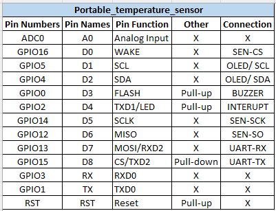

# Portable Temperature Sensor

<div align="center">
  
</div>

[](https://opensource.org/licenses/MIT)

## Overview

The Portable Temperature Sensor is a wireless IoT temperature monitoring device based on the ESP8266 NodeMCU platform. It uses a MAX6675 thermocouple interface to measure temperatures up to 1024°C with high precision, making it suitable for industrial monitoring, cooking, 3D printing, and scientific applications.

### Key Features

- **High-Temperature Measurement:** Uses the MAX6675 thermocouple for accurate measurements up to 1024°C
- **Wireless Connectivity:** Built-in WiFi for remote monitoring and control
- **MQTT Support:** Integrates with home automation systems and custom dashboards
- **Alarm System:** Configurable temperature thresholds with buzzer alerts
- **Interrupt Output:** Provides digital signal output when temperature exceeds thresholds
- **Custom PCB Design:** Optimized layout with full KiCad design files
- **Serial Communication:** Both USB and software serial interfaces for flexible integration

## Hardware Components

- **NodeMCU ESP8266** - Main controller with WiFi capability
- **MAX6675 Module** - K-type thermocouple interface
- **K-Type Thermocouple** - High-temperature sensing element
- **Buzzer** - For audible alerts
- **Passive Components** - Resistors, capacitors for circuit stability

## Pin Connections

| Pin Numbers | Pin Names | Pin Function | Other    | Connection   |
|-------------|-----------|-------------|----------|--------------|
| ADC0        | A0        | Analog Input | X        | X            |
| GPIO16      | D0        | WAKE        | X        | SEN-CS       |
| GPIO5       | D1        | SCL         | X        | OLED/ SCL    |
| GPIO4       | D2        | SDA         | X        | OLED/ SDA    |
| GPIO0       | D3        | FLASH       | Pull-up  | BUZZER       |
| GPIO2       | D4        | TXD1/LED    | Pull-up  | INTERRUPT    |
| GPIO14      | D5        | SCLK        | X        | SEN-SCK      |
| GPIO12      | D6        | MISO        | X        | SEN-SO       |
| GPIO13      | D7        | MOSI/RXD2   | X        | UART-RX      |
| GPIO15      | D8        | CS/TXD2     | Pull-down| UART-TX      |
| GPIO3       | RX        | RXD0        | X        | X            |
| GPIO1       | TX        | TXD0        | X        | X            |
| RST         | RST       | Reset       | Pull-up  | X            |

## Software Setup

### Prerequisites

- [PlatformIO](https://platformio.org/) (recommended) or Arduino IDE
- Required libraries:
  - PubSubClient for MQTT
  - EspSoftwareSerial for additional serial ports
  - Adafruit MAX6675 for thermocouple interface
  - GyverOLED for display support (optional - will be implemented separately)

### Installation

1. Clone this repository:
   ```
   git clone https://github.com/MOUNITH-H/Portable_temperature_sensor.git
   ```

2. Open the project in PlatformIO or Arduino IDE:
   - For PlatformIO: Open the `Portable_temperature_sensor` folder
   - For Arduino IDE: Open `src/main.cpp` as your sketch

3. Configure WiFi and MQTT settings:
   - Edit the connection parameters in `main.cpp`

4. Build and upload to your NodeMCU

## PCB Design

The project includes a custom PCB design created with KiCad. The design files are in the `pcb` folder:

- Full schematic in `pcb.kicad_sch`
- PCB layout in `pcb.kicad_pcb`
- Interactive BOM available in `pcb/bom/ibom.html`

## Usage

1. Power the device using USB or a 5V power source
2. The device will automatically connect to the configured WiFi network
3. Temperature data is published to the MQTT topic `portable_temp_sensor/temperature`
4. The buzzer will sound if the temperature exceeds the configured threshold
5. Configure alarm settings via the MQTT topic `portable_temp_sensor/settings`

## MQTT Topics

| Topic | Description | Message Format |
|-------|-------------|----------------|
| `portable_temp_sensor/temperature` | Current temperature readings | `{"temp": 25.4, "timestamp": 1620123456}` |
| `portable_temp_sensor/settings` | Device configuration | `{"threshold": 80, "buzzer_enabled": true}` |
| `portable_temp_sensor/status` | Device status information | `{"uptime": 3600, "wifi_strength": -67}` |

## Troubleshooting

- **No temperature readings:** Check thermocouple connections
- **Cannot connect to WiFi:** Verify credentials in the code
- **MQTT connection issues:** Confirm server address and port settings
- **Erratic readings:** Check for interference with thermocouple wires

## Contributing

Contributions are welcome! Please feel free to submit a Pull Request.

## License

This project is licensed under the MIT License - see the [LICENSE](LICENSE) file for details.

## Author

- **MOUNITH H** - *Initial work*